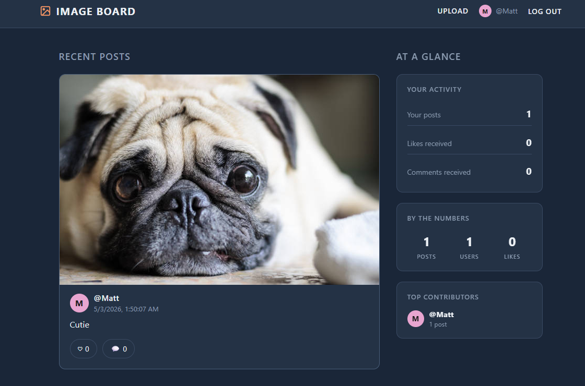
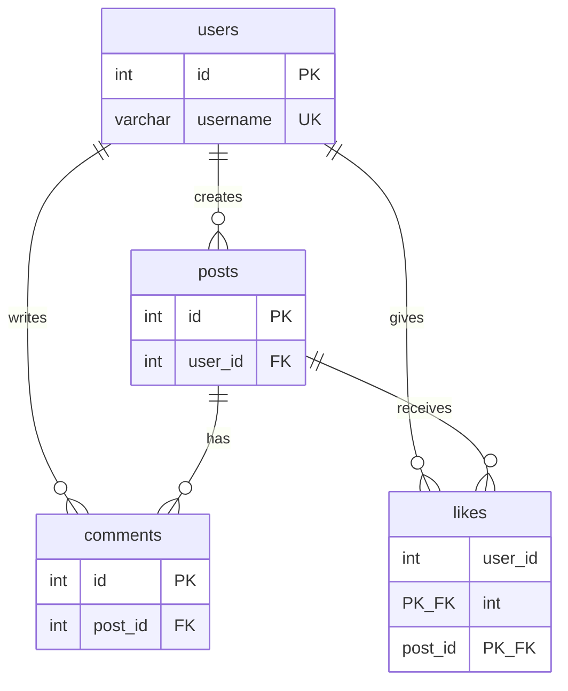

# 📸 Image-Sharing Web App

**Stack:** Node.js 18+ · Express · MySQL 8+ · EJS · bcrypt · multer · express-session

This is a small Node.js + Express + MySQL site where users register, upload images with captions, comment on posts, and like them. Built to demonstrate session-based authentication (bcrypt password hashing), file upload handling with multer, and a relational schema with cascading deletes and a composite-key constraint.



## Schema

User-post-interaction model with cascading deletes:



| Table | Purpose |
|---|---|
| `users` | Account records with bcrypt-hashed passwords |
| `posts` | Image uploads with optional captions |
| `comments` | Threaded comments per post |
| `likes` | Composite primary key `(user_id, post_id)` enforces one like per user per post |

## Files

`mysql/schema.sql` (database) · `app/server.js` (Express entry) · `app/routes/*` (auth, posts, interactions) · `app/views/*` (EJS templates)

## Quick Start

1. Install Node 18+ from [nodejs.org](https://nodejs.org).
2. Create the database:

   ```bash
   mysql -u root -p < mysql/schema.sql
   ```
3. From the `app/` directory:

   ```bash
   npm install
   cp .env.example .env       # then edit .env with your MySQL credentials
   npm start
   ```
   
4. Open <http://localhost:3000>.

---
**Author:** Matthew Li
